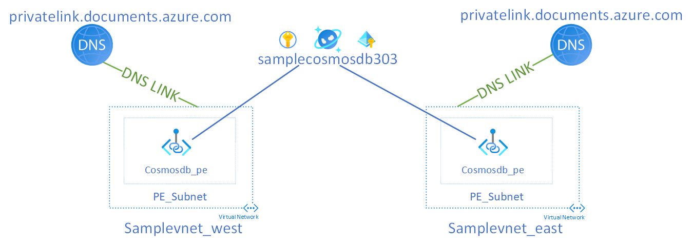

# 303 Cosmos DB SQL API with Read Replica
This template deploys a single region write cosmos db account with a read replica (east and west us regions) with 2 sql databases (autoscale and no autoscale) and 2 containers (per each db), system assigned identity enabled, customer managed keys and private endpoints per each VNET (East2 and West2). There are 2 deployment patterns with private endpoints and cosmosdb: 1) Dual Zone and 2) Single Zone, each with their own pros and cons. Both options are depicted below:
- Single Zone (1 private DNS zone for all regions). This method works if you need hybrid deployment and active-passive setup where you intend to failover from write region to read region. 

- Dual Zone (2x private DNS zone, for each region). This method works well if you are fully cloud-native, but does not work in a hybrid deployment model where you need to resolve from on-premise to Azure. 



This sample will deploy the single zone model. This sample assumes that a resource group has been previously created and is referenced as an input parameter. A sample input parameters file has been included as part of this example.

## Variables 
| Name | Description |
|-|-|
| resource_group_name | Name of existing resource group |
| location | Location where cosmos db will be deployed to | 
| cosmos_account_name | Name of cosmos db account | 
| cosmos_api | API for Cosmos db, should be "sql" in this example | 
| geo_locations | Locations for cosmos db geo replication | 
| sql_dbs | Cosmos SQL DBs to create | 
| sql_db_containers | Cosmos SQL DB containers to create per each db |
| key_vault_name | Name of the existing key vault | 
| key_vault_rg_name | Name of the resource group where key vault exists | 
| key_vault_key_name | Name of the existing key which is going to be used for encryption |  
| enable_systemassigned_identity | True/False flag to enable system assigned identity | 
| virtual_network_name | Virtual Network where cosmos db pe will be created, defaults to samplevnet_303 |
| vnet_address_space | VNET Address Space, defaults to 10.0.0.0/16 | 
| subnet_name | Subnet where cosmos db pe will be created, defaults to pe_subnet| 
| subnet_prefixes | PE Subnet Prefix, defaults to 10.0.0.0/24 | 
| private_dns_vnet_link_name | DNS Zone Link Name for Cosmos DB Private DNS Zone, defaults to sqlapi_zone_link | 
| dns_zone_group_name | Name of the zone group for the pe, defaults to pe_zone_group | 
| pe_name | Name of the private endpoint, defaults to cosmosdb_pe | 
| pe_connection_name | Name of the pe connection, defaults to pe_connection | 
| log_analytics_workspace_name | Log Analytics Workspace Name | 

Please see terraform.tfvars.sample for example inputs. Above is the minimal input requirements for the cosmos db module. 

## Usage
```bash
terraform plan -out example.tfplan
terraform apply example.tfplan
```